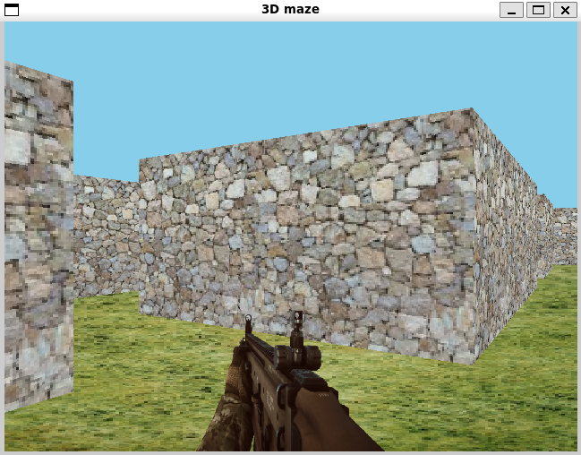

# Maze Project

Welcome to the **Maze Project**! This is an innovative maze game built using SDL2 and C, designed to challenge your navigation skills with complex mazes and interactive gameplay.




## Features

- **Real-time maze navigation**: Move through the maze in real-time with smooth controls.
- 
## Getting Started

Ready to dive into the maze? Follow these steps to get started:

1. **Clone the Repository:**

   ```bash
   git clone https://github.com/dinahamadi/Maze.git